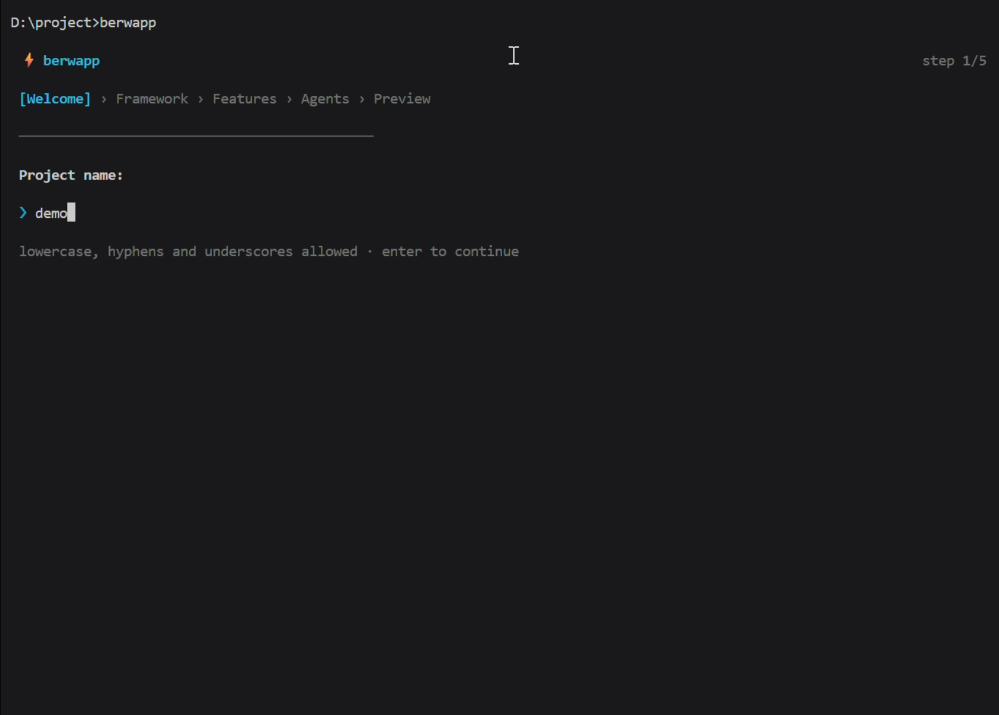
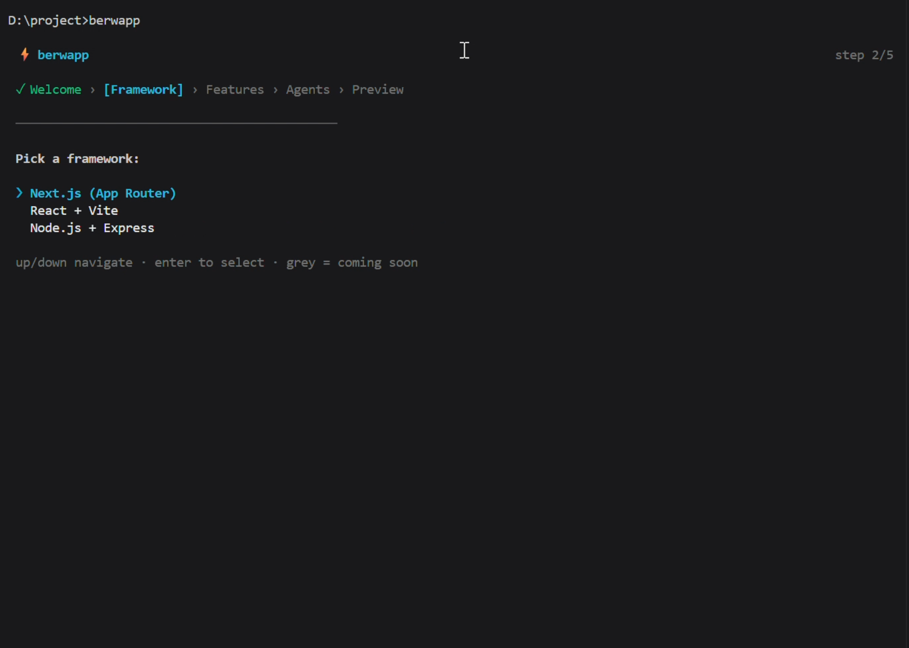
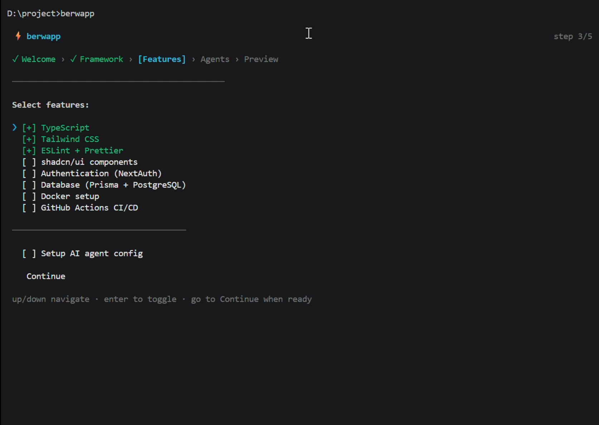
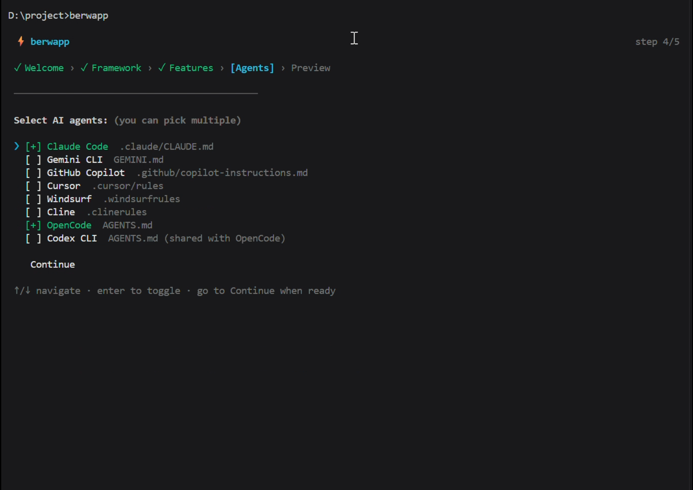
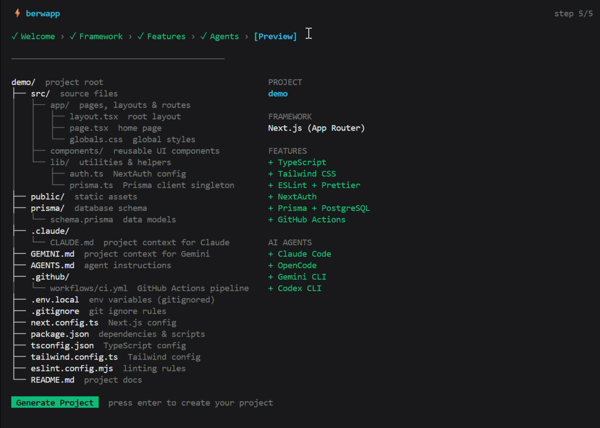

# 🚀 berwapp

The **terminal-based scaffolding tool** that sets up your web projects **in seconds**—with **AI agent configs** baked in.

  

---

## 🚀 Quick Start

```bash
# Install the CLI
npm install -g berwapp

# Create a new project
berwapp --name my-app
```


---

## ✨ Features

✅ **Interactive TUI** – 100% terminal-based project setup
✅ **AI Agent Ready** – Auto-generated `.claude/`, `.cursor/`, `GEMINI.md`
✅ **Framework Agnostic** – Next.js, React, Express
✅ **No Boilerplate BS** – Works instantly with `npm install -g berwapp`
✅ **MIT License** – Use anywhere, modify freely

---

## 🎬 Demo

https://github.com/user-attachments/assets/8f66fb3f-4992-408d-a294-ebfc1e956255

## 📸 TUI Screens

<table>
  <tr>
    <td align="center"><b>Welcome Screen</b><br></td>
    <td align="center"><b>Framework Selection</b><br></td>
  </tr>
  <tr>
    <td align="center"><b>Feature Checkboxes</b><br></td>
    <td align="center"><b>AI Agent Config</b><br></td>
  </tr>
  <tr>
    <td colspan="2" align="center"><b>Project Preview</b><br></td>
  </tr>
</table>

---

## 📥 Installation

```bash
# Global install (recommended)
npm install -g berwapp

# Run directly with npx
npx berwapp --name my-project
```

## 🚀 Usage

```bash
# Interactive mode
berwapp

# Skip prompts (defaults)
berwapp --yes

# Specify project name + framework
berwapp --name my-app --framework nextjs
```

## 🤝 Contributing

Issues? Feature requests? Open an [issue](https://github.com/H-sharma63/berwapp/issues)!

Want to contribute? Check out [CONTRIBUTION.md](CONTRIBUTION.md).

---

## 📜 License

MIT © Harshit

[](https://github.com/H-sharma63/berwapp/stargazers)

